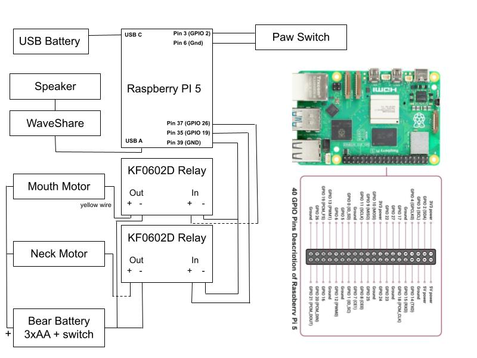

# Zaby
Zaby is an AI-powered teddy bear envisioned by a 7 yr old called Zach. 
Zaby is a clever, pedagogical, and funny teddy bear that loves talking math (although
you can easily change his personality via model_instr in main.py). Press his paw
to start/stop the conversation. Zaby responds to commands like "tell the time",
"restart the conversation", and "go to sleep".

Zaby uses Google Cloud Speech-to-Text and Text-to-Speech APIs and is powered by
Gemini 2.0 Flash. Runs on a Raspberry Pi 5. Bear animatronics include speech
envelope-tracked mouth movements. 

 

Here's a demo of the bear: https://x.com/davey_burke/status/1903682259003310308

## Parts list
- Story Time Teddy - https://www.cuddle-barn.com/products/storytime-teddie
- Raspberry Pi 5 SSD CanaKit - https://www.amazon.com/dp/B0DKQS5CXB
- WaveShare USB sound card - https://www.amazon.com/dp/B0CN1C1VPR
- DC solid state relay x 2 - https://www.amazon.com/dp/B00B888WVC
- USB battery - https://www.amazon.com/dp/B08T8TDS8S
- Mini backpack - https://www.amazon.com/dp/B0DL2LTMPP

## Connections / Assembly
Open the bear housing: cut the ziptie around battery housing, remove 4x screws on housing. Remove the speaker and circuit board. Disconnect the motor-activated internal switch (pulses the mouth motor). 
Keep the battery housing + switch + mouth motor + neck motor + paw button. Remove bear's "book" and red jacket so it looks steazy. 

The bear has two motors - one for his rotating neck and one for his mouth. The mouth motor turns to a stop, resulting in a lot of back EMF and makes it unsuitable for a motor controller. The bear has a microswitch in his paw which we use to trigger start/stop of the conversation. 

Raspberry PI GPIO's trigger the solid state DC-to-DC relays to turn on/off the motors (one for each motor).
The relays just apply the bear's battery power to each of the mouth and neck motors. Speech envelope tracking converts
root mean square energy into delay times for the mouth motor so the movement approximately tracks the speech. 

Close the housing up, put the relays outside of housing but inside the fur. Put the Raspberry Pi, USB battery inside the backpack. Consider something to allow air circulation to the
Canakit fan, e.g. lego pieces. Use self-adhesive velcro to stick WaveShare speaker and USB stick
to outside of the backback. Remove one of the speakers (stereo no necessary).

Note we use an SSD/NVME Raspberry PI as running from sdcard can get slow (particularly boot)



## Python environment
```
sudo apt-get update
sudo apt install libportaudio2 libportaudiocpp0 portaudio19-dev python3-dev
python -m venv zaby-env
pip install -r requirements.txt
source zaby-env/bin/activate
```

## Google Cloud environment
Requires a Google Cloud project with Speech-to-Text and Text-to-Speech APIs enabled
from console.cloud.google.com.

Install gcloud on the Raspberry PI (see https://cloud.google.com/sdk/docs/install#deb)

Run these commands to set the project and login:
```
gcloud init
gcloud config set project your-project-name
gcloud auth application-default login
```
## Gemini
Get an API key from aistudio.google.com and paste into self.API_KEY in ai_agent.py 

## Run from command line
```
source zaby-env/bin/activate
python main.py
```

## Systemd start on boot
Run these commands (assumes code lives in /Code/Zaby - edit the file content accordingly):

```
sudo cp zaby.service /etc/systemd/system/
sudo cp asound.conf /etc/
```

Some useful commands to enable/disable, start/stop, view logs respectively:
```
sudo systemctl enable zaby.service
sudo systemctl disable zaby.service

sudo systemctl start zaby.service
sudo systemctl stop zaby.service

sudo journalctl -u zaby.service
```
## Raspberry PI boot optimizations
```
# Set default to CLI (no GUI on boot)
sudo systemctl set-default multi-user.target
sudo systemctl stop wayvnc.service
sudo systemctl stop wayvnc-control.service
sudo systemctl disable wayvnc.service
sudo systemctl disable wayvnc-control.service

# When you need VNC, SSH in and run:
sudo systemctl start graphical.target

# Don't wait for full network at boot
sudo systemctl disable NetworkManager-wait-online.service

# Disable services we don't need
sudo systemctl disable ModemManager.service
sudo systemctl disable cups.service
sudo systemctl disable bluetooth.service
```

## Future ideas (aka make this a real product)
- Android/iOS app to setup Wi-Fi and configure personality
- Cost down parts, better housing of parts
- Safety filters
- Other commands
- Camera for eyes so the bear can see
- Kart for bear to drive around and follow you

